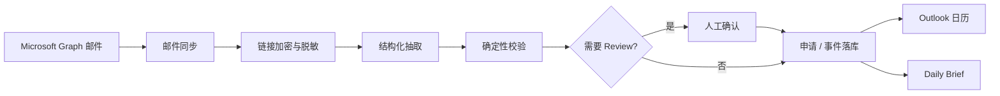

# Recruitment Inbox Agent

隐私优先的个人求职邮箱 Agent。把自动转发到 Outlook 的校招邮件，变成可审核的申请状态、日历事件和每日 Daily Brief。

大模型只做语义抽取。数据库、日历和发信全部由确定性工作流完成。无法安全判断的事项进入人工 Review，不会让模型直接改库、改日历或发邮件。

```text
126 / 其他校招邮箱
        │ 自动转发
        ▼
   Dedicated Outlook
        │ Microsoft Graph
        ▼
Recruitment Inbox Agent
        │
        ├── PostgreSQL（申请 / 事件 / Review / 审计）
        ├── Outlook Calendar（面试 / 测评截止）
        └── Daily Brief（每天本地 08:00）
```

## 做什么

- 同步 Outlook 收件箱，识别招聘相关邮件（含 126 嵌套转发）
- 在进入模型前清洗 HTML、去掉追踪像素，并加密测评 / 面试等动作链接
- 用结构化输出抽取公司、岗位、面试、截止日期、Offer / 拒信
- 确定性匹配已审核公司目录；对不上或有歧义时进入 Review
- 维护 Application 状态、招聘事件和待办，避免重试写出重复记录
- 在 Outlook 日历写入面试 / 测评截止（可关闭）
- 每天发送 Daily Brief；控制台提供 Review 队列和运行开关

## 不做什么

- 不申请 `Mail.ReadWrite`，不改原邮件
- 不下载附件，不把原始正文或明文密钥 URL 交给模型
- 不从公司名、发件域名或地点静默推断时区
- 不自动回复招聘方
- 不支持 Gmail、IMAP 或浏览器自动化（除非另行实现）

完整约束见 [AGENTS.md](AGENTS.md)。

## 当前范围

技术设计中的 Phase 0–9A 已落地。Alembic head 为 `20260814_0011`。

| 界面 | 路径 | 说明 |
| --- | --- | --- |
| 控制台 | `/agent` | 运行开关、同步、处理待办、Brief 收件人 |
| Review | `/reviews` | 时区、公司、改期、日历等人工确认 |
| Brief 预览 | `/brief/today` | 控制台样式预览；发出的邮件保持 mail-safe |
| 登录 | `/auth/login` | 管理员登录，不替换邮箱 Token Cache |
| 连接邮箱 | `/auth/mailbox/connect` | 显式连接 / 更换 Outlook |

## 架构

领域逻辑与 Microsoft Graph、LangChain、LangGraph、Azure OpenAI、Azure Functions、PostgreSQL 实现解耦。LangGraph 只编排执行；PostgreSQL 才是业务真相。



## 文档

| 文档 | 内容 |
| --- | --- |
| [docs/README.md](docs/README.md) | 文档索引 |
| [最终技术设计](docs/01_FINAL_TECHNICAL_DESIGN.md) | 架构与 phase 边界 |
| [领域模型](docs/02_DOMAIN_MODEL.md) | Application、公司、事件、幂等 |
| [隐私模型](docs/03_PRIVACY_MODEL.md) | 脱敏、加密、日志边界 |
| [工作流](docs/04_GRAPH_WORKFLOW.md) | LangGraph、Review、恢复 |
| [运维](docs/05_OPERATIONS.md) | 配置、迁移、Azure 部署 |
| [测试](docs/06_TEST_PLAN.md) | 自动化覆盖范围 |
| [开源清单](docs/07_OPEN_SOURCE.md) | 公开仓库前要处理的事项 |
| [CONTRIBUTING.md](CONTRIBUTING.md) | 本地开发与 PR |
| [SECURITY.md](SECURITY.md) | 漏洞报告与安全边界 |

## 本地运行

需要 Python 3.12+、[uv](https://docs.astral.sh/uv/) 和 PostgreSQL。

```powershell
Copy-Item .env.example .env
uv sync --all-groups --locked
uv run alembic upgrade head
uv run seed-companies
uv run uvicorn recruitment_agent.api.app:app --reload
```

补全 `.env` 后打开 `http://127.0.0.1:8000/auth/login` 完成管理员登录，再在控制台点击「连接 / 更换 Outlook」。管理员登录不会覆盖邮箱 Token Cache。

回调地址必须与 Entra App Registration 中的 Web redirect URI 完全一致。

生成 32 字节密钥（Token Cache、Web Session、Ops Token 各用一把，不要复用）：

```powershell
python -c "import base64,secrets; print(base64.b64encode(secrets.token_bytes(32)).decode())"
```

这些值是密钥，不要提交到 Git。云端用 Function App 设置或 Key Vault 引用注入。完整变量见 [.env.example](.env.example) 和 [docs/05_OPERATIONS.md](docs/05_OPERATIONS.md)。

## 测试

```powershell
uv run ruff check .
uv run mypy src
uv run pytest
```

Docker 可用时再跑 PostgreSQL 集成测试：

```powershell
$env:RUN_POSTGRES_INTEGRATION="1"
uv run pytest -m integration
```

## 生产部署

生产跑在 Azure Functions Flex Consumption + PostgreSQL Flexible Server + Key Vault。`main` 上 `quality` 通过后自动部署应用；Alembic / Bicep 变更走基础设施工作流，迁移由 VNet 内的 Container Apps Job 执行。

```powershell
./scripts/bootstrap-azure.ps1 `
  -ResourceGroupName "<resource-group>" `
  -GitHubRepository "<owner>/<repo>"
```

重新执行 bootstrap 会轮换 Microsoft client secret 和应用加密密钥，只在有意轮换时运行。步骤与开关见 [docs/05_OPERATIONS.md](docs/05_OPERATIONS.md)。

## 安全与隐私

- 原始邮件正文、OAuth token、明文动作 URL 不入库、不进日志、不进 LangGraph checkpoint
- 模型只看到脱敏文本和 `ACTION_LINK_*` 不透明引用
- Review 页不解密动作链接；Daily Brief 只在最终渲染时解密普通待办链接
- 控制面 API 需要独立的 `OPS_API_TOKEN`；浏览器走签名 session 与 CSRF

发现漏洞请按 [SECURITY.md](SECURITY.md) 私下报告，不要在公开 Issue 里贴密钥或邮件原文。

## 许可证

Copyright 2026 Theo。本项目按 [Apache License 2.0](LICENSE) 授权，说明见 [NOTICE](NOTICE)。

Microsoft、Outlook、Azure、LangGraph、LangChain 是其各自所有者的商标。本项目不是这些公司的官方产品。

公开仓库前仍须处理 GitHub `production` 环境里的明文变量，见 [docs/07_OPEN_SOURCE.md](docs/07_OPEN_SOURCE.md)。
